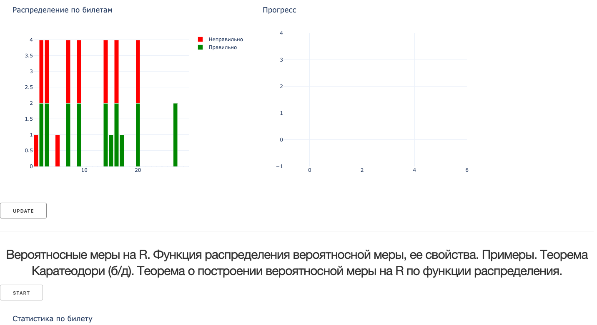
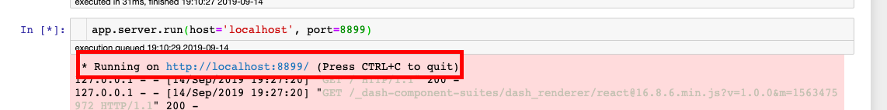

# Exam Helper
 Простой способ подготовиться к любому экзамену
 
 

## Как запустить
1. Клонируем репозиторй.
2. Запускаем все ячейки в `main.ipynb`.
3. Переходим по появившейся в последней ячейке ссылке.

## Как добавить программу своего экзамена
1. Идем в папку `program`
2. Меняем `program.csv` на свою программу (формат номер_билета;условия)
